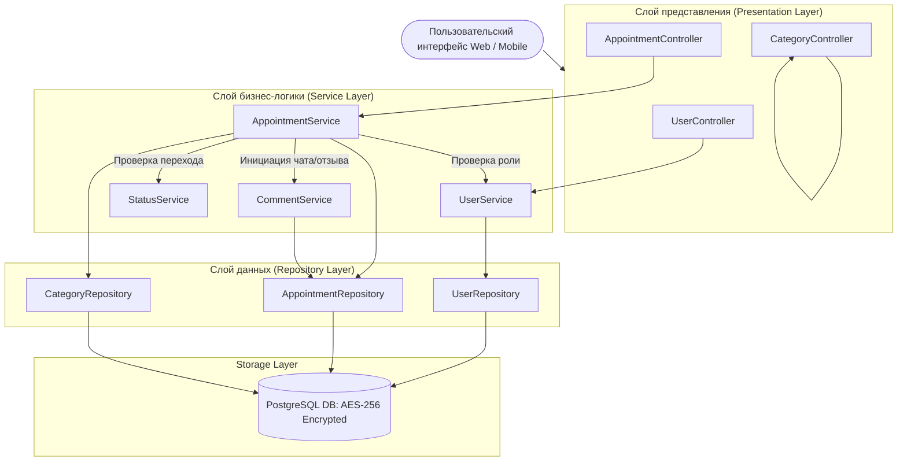

# Диаграмма компонентов (Component Diagram)

Диаграмма иллюстрирует внутреннюю структуру модулей вашего приложения и связи между ними в соответствии со слоистой архитектурой.

```mermaid
graph TD
    %% Входящие запросы
    Client([Пользовательский интерфейс Web / Mobile]) --> Controllers

    %% Компоненты слоя Представления
    subgraph Controllers ["Слой представления (Presentation Layer)"]
        UC[UserController]
        AC[AppointmentController]
        CC[CategoryController]
    end

    %% Компоненты слоя Бизнес-логики
    subgraph Services ["Слой бизнес-логики (Service Layer)"]
        US[UserService]
        AS[AppointmentService]
        STS[StatusService]
        CMS[CommentService]
    end

    %% Компоненты слоя Доступа к данным
    subgraph Repositories ["Слой данных (Repository Layer)"]
        UR[UserRepository]
        AR[AppointmentRepository]
        CR[CategoryRepository]
    end

    %% Связи Контроллер -> Сервис
    UC --> US
    AC --> AS
    CC --> CC

    %% Связи между Сервисами (Бизнес-логика)
    AS -->|Проверка роли| US
    AS -->|Проверка перехода| STS
    AS -->|Инициация чата/отзыва| CMS

    %% Связи Сервис -> Репозиторий
    US --> UR
    AS --> AR
    AS --> CR
    CMS --> AR

    %% База данных
    subgraph DB_Layer ["Storage Layer"]
        DB[(PostgreSQL DB: AES-256 Encrypted)]
    end

    UR --> DB
    AR --> DB
    CR --> DB
```
